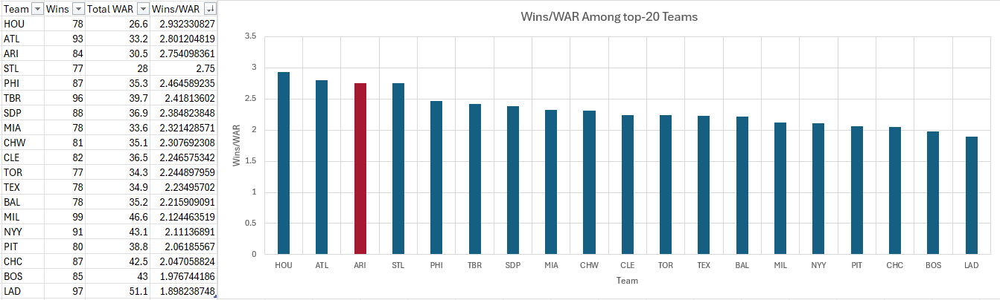

# Presentation Script

## **Torrey Lovullo:** _To Keep or Not to Keep?_

Hello and thank you for listening to my presentation today about Torrey Lovullo. I hope that as you weigh the decision of whether or not to re-sign him beyond this season. Managers are an important leader of a baseball team and can have a real effect on winning.

## Oh Captain My Captain

![ClutchPoints. (2026). Rams head coach Sean McVay [Photograph]. https://wp.clutchpoints.com/wp-content/uploads/2026/02/Rams-head-coach-Sean-McVay.jpg](images/Picture1.jpg "(ClutchPoints, 2026)")

When we think of head coaches in sports we think of excellent play callers, like Sean McVay here. In football coaches are talking constantly with support teams and the Quarterback on field through their headset about what plays to run.

![GQ. (n.d.). 2267126569 [Photograph]. https://media.gq-magazine.co.uk/photos/69ba922a731ed71d28e853c0/master/w_1600%2Cc_limit/2267126569](images/pep.jpg "(GQ, n.d.)")

The other football has legendary play callers like Pep Guardiola who has revolutionized the way the game is played with his tactics.

![Chicago Bulls. (2018). 180117 Jackson huddle [Photograph]. NBA.com. https://cdn.nba.com/teams/legacy/s.cdn.turner.com/drp/nba/bulls/sites/default/files/180117-jackson-huddle.jpg](images/phil.jpg "(Chicago Bulls, 2018)")

Basketball had Phil Jackson, who won 11 championships with the Chicago Bulls and the LA Lakers. A similarity between all of these leaders is that, apart from their leadership what sets them apart from lesser coaches is their incredible strategy and understanding of the game. With the game on the line, these are the coaches you want drawing up a play that can win your team the game.

![Arizona Sports. (2018). Torey Lovullo and Alek Thomas [Photograph]. https://cdn.arizonasports.com/arizonasports/wp-content/uploads/2023/10/torey-lovullo-alek-thomas-nlcs-diamondbacks-phillies-e1698010907801.jpg](images/torrey.jpg "(Arizona Sports, 2018)")

In Baseball Managers have a different role. Baseball has very little opportunity for schemes and plays to draw up. With the game on the line, bottom of the 9th, all a manager can do is give the player they believe in the most the opportunity and hope that they execute. What sets a great manager apart is their leadership. A great manager in baseball is able to keep their team focused throughout the long 162 game season extracting every ounce of talent from their players day in and day out, and Torrey has done a great job of that this year.

This is a graph of the top 20 winningest teams this season, and the amount of Wins they've eached gained per Win Above Replacement. Wins Above Replacement or WAR is an attempt to measure a players total value. Arizona this season ranks third in Wins per WAR. I've limited it to the top 20 teams as every season the bottom 10 teams are not really competing, don't have a lot of talent, but in 6 months they're bound to win around 50 games which on paper would rank some of them higher in Wins/WAR. Of the teams that are really competing and trying to win day in and day out, only Houston and Atlanta have done a better job at winning with the amount of talent they have playing on the field.

With the Diamondbacks already competing in a market that struggles to compete with larger media markets, they have an added need to get all the value they can out of what they can afford. A manager is one of a team's less expensive payroll items compared to players. Torrey's ability to lead the clubhouse and get all the value out of players is a great competitve advantage that will help the Diamondbacks compete in the years to come as we continue building out our roster.

## References

ClutchPoints. (2026). Rams head coach Sean McVay [Photograph]. 

;https://wp.clutchpoints.com/wp-content/uploads/2026/02/Rams-head-coach-Sean-McVay.jpg

GQ. (n.d.). 2267126569 [Photograph].

https://media.gq-magazine.co.uk/photos/69ba922a731ed71d28e853c0/master/w_1600%2Cc_limit/2267126569

Chicago Bulls. (2018). 180117 Jackson huddle [Photograph]. NBA.com.

https://cdn.nba.com/teams/legacy/s.cdn.turner.com/drp/nba/bulls/sites/default/files/180117-jackson-huddle.jpg

GQ. (n.d.). 2267126569 [Photograph].

https://media.gq-magazine.co.uk/photos/69ba922a731ed71d28e853c0/master/w_1600%2Cc_limit/2267126569

FanGraphs. (2026). Major League leaders: 2026 batting. 

https://www.fangraphs.com/leaders/major-league?pos=all&stats=bat&lg=all&qual=y&type=8&season=2026&month=0&season1=2026&ind=0

Sports Business Journal. (n.d.). [Photograph]. 

https://leadersgroup-sbj-prod.web.arc-cdn.net/resizer/v2/ZZRRMWTINLBJ3YOEV3FGM2G4XM.jpg?auth=81d2a06c8bd005f6f256c756363b4de665042b1d982165b22f6f89226ac6fc65&width=800&height=533

